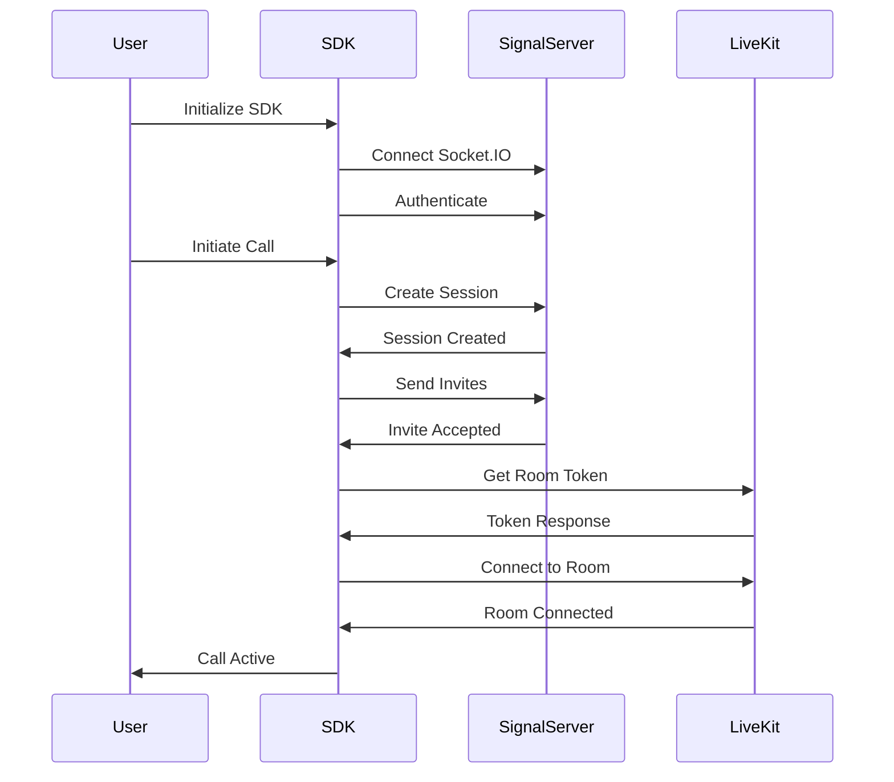

# Go CallPad Web SDK Documentation

A comprehensive headless SDK for building real-time audio/video communication features in React applications. Built on LiveKit WebRTC, Socket.IO signaling, and REST APIs.

## Table of Contents

- [Getting Started](#getting-started)
- [Core Concepts](#core-concepts)
- [Call Management](#call-management)
- [Media Controls](#media-controls)
- [Participant Management](#participant-management)
- [Data Channels & Features](#data-channels--features)
- [UI Implementation](#ui-implementation)
- [Error Handling](#error-handling)
- [API Reference](#api-reference)
- [Best Practices](#best-practices)

## Getting Started

### Installation

```bash
npm install vg-x07df livekit-client socket.io-client
# or
yarn add vg-x07df livekit-client socket.io-client
# or
pnpm add vg-x07df livekit-client socket.io-client
```

### Quick Start

```tsx
import React from 'react';
import { RtcProvider, useCallActions, useCallState } from 'vg-x07df';

// Main app wrapper
function App() {
  const rtcOptions = {
    appId: 'your-app-id',
    signalHost: 'https://your-signal-server.com',
    authProvider: () => {
      // Return the current user's access token
      // This should be your app's access token, not a session token
      return getAccessToken(); // Your token retrieval function
    },
    logLevel: 'info' as const,
    enableDebug: false
  };

  return (
    <RtcProvider options={rtcOptions}>
      <CallInterface />
    </RtcProvider>
  );
}

// Call interface component
function CallInterface() {
  const { initiate, leave } = useCallActions();
  const session = useCallState();

  const startCall = async () => {
    try {
      await initiate(['user123'], 'VIDEO');
    } catch (error) {
      console.error('Failed to start call:', error);
    }
  };

  if (session.id) {
    return (
      <div>
        <h2>Call in progress</h2>
        <p>Session: {session.id}</p>
        <p>Status: {session.status}</p>
        <button onClick={leave}>Leave Call</button>
      </div>
    );
  }

  return (
    <div>
      <button onClick={startCall}>Start Video Call</button>
    </div>
  );
}
```

### Configuration Options

```typescript
interface RtcOptions {
  // Required
  appId: string;              // Your application identifier
  signalHost: string;         // Signal server URL
  authProvider: () => string | null; // Function returning access token

  // Optional
  logLevel?: 'debug' | 'info' | 'warn' | 'error';
  enableDebug?: boolean;      // Enable detailed logging
  log?: (level: LogLevel, message: string, meta?: any) => void; // Custom logger
}
```

### Authentication

The `authProvider` function is critical for SDK operation. It should return your application's **access token** (not a session token):

```tsx
// Example implementation
const authProvider = () => {
  // Return your app's current access token
  // This is typically stored in cookies, localStorage, or state management
  return getCurrentAccessToken();
};

// With cookie-based auth (recommended)
import { Cookies } from 'react-cookie';

const cookies = new Cookies();
const authProvider = () => {
  return cookies.get('ACCESS_TOKEN') || null;
};

// With token refresh logic
const authProvider = () => {
  const token = getCurrentAccessToken();
  
  // Check if token is expired and refresh if needed
  if (!token || isTokenExpired(token)) {
    // Trigger refresh flow - this should be synchronous for the current token
    // For async refresh, handle it outside the authProvider
    return getLastValidToken(); 
  }
  
  return token;
};
```

**Important Notes:**
- Return the **access token**, not session tokens or refresh tokens
- The SDK will use this token to authenticate with the signal server
- This function is called whenever authentication is needed
- Return `null` if no valid token is available
- Keep this function synchronous - handle async token refresh elsewhere

## Core Concepts

### Architecture Overview

The SDK consists of four main components:

1. **LiveKit Client**: Handles WebRTC media streams and room management
2. **Socket.IO Client**: Real-time signaling for call events and state synchronization
3. **REST API Client**: Call initiation, user management, and session control
4. **State Management**: Zustand stores for reactive state updates

### Provider Pattern

The `RtcProvider` must wrap your application to provide SDK context:

```tsx
<RtcProvider options={rtcOptions}>
  {/* Your app components */}
</RtcProvider>
```

### Connection Flow



### Session States

```typescript
type SessionStatus = 
  | "initializing"  // Setting up the call
  | "pending"       // Waiting for participants
  | "ready"         // LiveKit room ready
  | "active"        // Call in progress
  | "ended";        // Call terminated
```

## Call Management

### Initiating Calls

```tsx
import { useCallActions } from 'vg-x07df';

function StartCallButton() {
  const { initiate } = useCallActions();

  const startVideoCall = async () => {
    try {
      const response = await initiate(
        ['user123', 'user456'], // Participant user IDs
        'VIDEO' // or 'AUDIO'
      );
      console.log('Call initiated:', response);
    } catch (error) {
      console.error('Failed to initiate call:', error);
    }
  };

  return <button onClick={startVideoCall}>Start Call</button>;
}
```

### Handling Incoming Calls

```tsx
import { useIncomingInvite, useCallActions } from 'vg-x07df';

function IncomingCallHandler() {
  const incomingInvite = useIncomingInvite();
  const { accept, decline } = useCallActions();

  if (!incomingInvite) {
    return null;
  }

  const handleAccept = async () => {
    try {
      await accept();
      // SDK automatically connects to the call room
    } catch (error) {
      console.error('Failed to accept call:', error);
    }
  };

  const handleDecline = async () => {
    try {
      await decline('User busy');
    } catch (error) {
      console.error('Failed to decline call:', error);
    }
  };

  return (
    <div className="incoming-call-modal">
      <h3>Incoming {incomingInvite.mode} Call</h3>
      <p>From: {incomingInvite.caller.firstName} {incomingInvite.caller.lastName}</p>
      <p>Expires in: {Math.round(incomingInvite.expiresInMs / 1000)}s</p>
      <button onClick={handleAccept}>Accept</button>
      <button onClick={handleDecline}>Decline</button>
    </div>
  );
}
```

### Managing Active Calls

```tsx
import { useCallActions, useSessionId } from 'vg-x07df';

function CallControls() {
  const sessionId = useSessionId();
  const { invite, leave, end, transfer, kick } = useCallActions();

  // Invite additional participants
  const inviteParticipant = async () => {
    if (!sessionId) return;
    await invite(['user789']);
  };

  // Leave call (keeps call active for others)
  const leaveCall = async () => {
    await leave();
  };

  // End call for everyone
  const endCall = async () => {
    await end();
  };

  // Transfer call to another participant
  const transferCall = async () => {
    await transfer('participant-id', 'Transferring to support');
  };

  // Remove a participant
  const kickParticipant = async (participantId: string) => {
    await kick(participantId, 'Violation of call policy');
  };

  return (
    <div className="call-controls">
      <button onClick={inviteParticipant}>Add Participant</button>
      <button onClick={leaveCall}>Leave</button>
      <button onClick={endCall}>End Call</button>
    </div>
  );
}
```

### Monitoring Call State

```tsx
import { useCallState, useConnectionState, useSessionDuration } from 'vg-x07df';

function CallStatus() {
  const session = useCallState();
  const connectionState = useConnectionState();
  const duration = useSessionDuration();

  return (
    <div className="call-status">
      <p>Session ID: {session.id}</p>
      <p>Status: {session.status}</p>
      <p>Mode: {session.mode}</p>
      <p>Role: {session.role}</p>
      <p>Connection: {connectionState}</p>
      <p>Duration: {duration}</p>
    </div>
  );
}
```

## Media Controls

### Audio/Video Toggle

```tsx
import { useTrackToggle, Track } from 'vg-x07df/livekit';

function MediaControls() {
  // Microphone control
  const { 
    toggle: toggleAudio, 
    enabled: isAudioEnabled,
    pending: isAudioPending 
  } = useTrackToggle({ 
    source: Track.Source.Microphone 
  });

  // Camera control
  const { 
    toggle: toggleVideo, 
    enabled: isVideoEnabled,
    pending: isVideoPending
  } = useTrackToggle({ 
    source: Track.Source.Camera 
  });

  return (
    <div className="media-controls">
      <button 
        onClick={toggleAudio} 
        disabled={isAudioPending}
      >
        {isAudioEnabled ? '🎤 Mute' : '🔇 Unmute'}
      </button>
      
      <button 
        onClick={toggleVideo}
        disabled={isVideoPending}
      >
        {isVideoEnabled ? '📹 Stop Video' : '📷 Start Video'}
      </button>
    </div>
  );
}
```

### Device Selection

```tsx
import { useMediaDevices, useMediaDeviceSelect } from 'vg-x07df/livekit';

function DeviceSettings() {
  const devices = useMediaDevices();
  const { 
    activeDeviceId: activeMicId, 
    setActiveMediaDevice: setMic 
  } = useMediaDeviceSelect({ kind: 'audioinput' });
  
  const { 
    activeDeviceId: activeCameraId, 
    setActiveMediaDevice: setCamera 
  } = useMediaDeviceSelect({ kind: 'videoinput' });

  return (
    <div className="device-settings">
      <label>
        Microphone:
        <select 
          value={activeMicId} 
          onChange={(e) => setMic(e.target.value)}
        >
          {devices.audioinput?.map(device => (
            <option key={device.deviceId} value={device.deviceId}>
              {device.label}
            </option>
          ))}
        </select>
      </label>

      <label>
        Camera:
        <select 
          value={activeCameraId} 
          onChange={(e) => setCamera(e.target.value)}
        >
          {devices.videoinput?.map(device => (
            <option key={device.deviceId} value={device.deviceId}>
              {device.label}
            </option>
          ))}
        </select>
      </label>

      <label>
        Speaker:
        <select>
          {devices.audiooutput?.map(device => (
            <option key={device.deviceId} value={device.deviceId}>
              {device.label}
            </option>
          ))}
        </select>
      </label>
    </div>
  );
}
```

### Screen Sharing

```tsx
import { useTrackToggle, Track } from 'vg-x07df/livekit';

function ScreenShareButton() {
  const { 
    toggle: toggleScreenShare, 
    enabled: isScreenSharing,
    pending
  } = useTrackToggle({ 
    source: Track.Source.ScreenShare,
    captureOptions: {
      audio: true, // Include system audio
      selfBrowserSurface: 'exclude' // Don't show current tab
    }
  });

  return (
    <button 
      onClick={toggleScreenShare}
      disabled={pending}
    >
      {isScreenSharing ? '⬜ Stop Sharing' : '🖥️ Share Screen'}
    </button>
  );
}
```

### Video Rendering

```tsx
import { 
  VideoTrack, 
  AudioTrack,
  useParticipants,
  useIsSpeaking 
} from 'vg-x07df/livekit';
import { hasVideoTrack } from 'vg-x07df/utils';

function ParticipantTile({ participant }) {
  const isSpeaking = useIsSpeaking(participant);
  const hasVideo = hasVideoTrack(participant);

  return (
    <div className={`participant-tile ${isSpeaking ? 'speaking' : ''}`}>
      {hasVideo ? (
        <VideoTrack 
          participant={participant} 
          source={Track.Source.Camera}
          className="video-element"
        />
      ) : (
        <div className="avatar">
          {participant.identity.charAt(0)}
        </div>
      )}
      
      <AudioTrack 
        participant={participant} 
        source={Track.Source.Microphone}
      />
      
      <div className="participant-name">
        {participant.identity}
      </div>
    </div>
  );
}

function VideoGrid() {
  const participants = useParticipants();

  return (
    <div className="video-grid">
      {participants.map(participant => (
        <ParticipantTile 
          key={participant.identity} 
          participant={participant} 
        />
      ))}
    </div>
  );
}
```

## Participant Management

### Listing Participants

```tsx
import { useParticipantList } from 'vg-x07df';

function ParticipantList() {
  const {
    participants,
    pinnedParticipants,
    currentPage,
    totalPages,
    pageSize,
    nextPage,
    prevPage,
    togglePin,
    isPinned
  } = useParticipantList({
    pageSize: 10,
    includeLocalParticipant: true,
    sortBy: 'speaking' // or 'name' or 'raised-hand'
  });

  return (
    <div className="participant-list">
      {/* Pinned participants */}
      {pinnedParticipants.length > 0 && (
        <div className="pinned-section">
          <h4>Pinned</h4>
          {pinnedParticipants.map(p => (
            <ParticipantItem 
              key={p.identity} 
              participant={p}
              isPinned={true}
              onTogglePin={() => togglePin(p.identity)}
            />
          ))}
        </div>
      )}

      {/* Regular participants */}
      <div className="participants-section">
        {participants.map(p => (
          <ParticipantItem 
            key={p.identity} 
            participant={p}
            isPinned={isPinned(p.identity)}
            onTogglePin={() => togglePin(p.identity)}
          />
        ))}
      </div>

      {/* Pagination */}
      {totalPages > 1 && (
        <div className="pagination">
          <button onClick={prevPage} disabled={currentPage === 1}>
            Previous
          </button>
          <span>Page {currentPage} of {totalPages}</span>
          <button onClick={nextPage} disabled={!hasNextPage}>
            Next
          </button>
        </div>
      )}
    </div>
  );
}
```

### Participant Metadata & Permissions

```tsx
import { 
  useParticipantMetadata, 
  useParticipantPermissions,
  useParticipantProfile 
} from 'vg-x07df';

function ParticipantInfo({ participant }) {
  const metadata = useParticipantMetadata(participant);
  const permissions = useParticipantPermissions(participant);
  const profile = useParticipantProfile(participant.identity);

  return (
    <div className="participant-info">
      
      <h4>{profile?.firstName} {profile?.lastName}</h4>
      <p>@{profile?.username}</p>
      <p>Role: {metadata?.role}</p>
      
      {/* Permission-based actions */}
      <div className="actions">
        {permissions.canMute && (
          <button onClick={() => muteParticipant(participant.identity)}>
            Mute
          </button>
        )}
        {permissions.canKick && (
          <button onClick={() => kickParticipant(participant.identity)}>
            Remove
          </button>
        )}
        {permissions.canTransfer && (
          <button onClick={() => transferToParticipant(participant.identity)}>
            Transfer Host
          </button>
        )}
      </div>
    </div>
  );
}
```

### Speaking & Activity Detection

```tsx
import { 
  useIsSpeaking, 
  useSpeakingParticipants,
  useConnectionQualityIndicator 
} from 'vg-x07df/livekit';

function ActiveSpeakers() {
  const speakingParticipants = useSpeakingParticipants();

  return (
    <div className="active-speakers">
      <h3>Currently Speaking</h3>
      {speakingParticipants.map(participant => (
        <SpeakerIndicator key={participant.identity} participant={participant} />
      ))}
    </div>
  );
}

function SpeakerIndicator({ participant }) {
  const isSpeaking = useIsSpeaking(participant);
  const { quality } = useConnectionQualityIndicator({ participant });

  return (
    <div className={`speaker ${isSpeaking ? 'active' : ''}`}>
      <span>{participant.identity}</span>
      <ConnectionQuality quality={quality} />
    </div>
  );
}

function ConnectionQuality({ quality }) {
  const qualityColors = {
    excellent: 'green',
    good: 'yellow',
    poor: 'red',
    unknown: 'gray'
  };

  return (
    <span style={{ color: qualityColors[quality] }}>
      {quality === 'excellent' && '●●●'}
      {quality === 'good' && '●●○'}
      {quality === 'poor' && '●○○'}
      {quality === 'unknown' && '○○○'}
    </span>
  );
}
```

## Data Channels & Features

### Setting Up Data Channels

Data channels enable real-time features like chat, reactions, and raise hand. Wrap your call interface with `DataChannelProvider`:

```tsx
import { LiveKitRoom } from 'vg-x07df/livekit';
import { DataChannelProvider } from 'vg-x07df/channel';

function CallInterface() {
  const session = useCallState();
  
  if (!session.livekitInfo) {
    return <div>Connecting...</div>;
  }

  return (
    <LiveKitRoom
      token={session.livekitInfo.token}
      serverUrl={session.livekitInfo.url}
      connect={true}
      audio={true}
      video={false}
      options={{
        adaptiveStream: true,
        dynacast: true,
        videoCaptureDefaults: {
          resolution: VideoPresets.h720
        }
      }}
    >
      <DataChannelProvider 
        features={['chat', 'reactions', 'raiseHand']} // Enable features
      >
        <CallContent />
      </DataChannelProvider>
    </LiveKitRoom>
  );
}
```

### Chat Implementation

```tsx
import { useChat } from 'vg-x07df/channel';

function ChatPanel() {
  const { 
    entries, 
    send, 
    edit, 
    remove, 
    react, 
    unreact,
    isOwnEntry,
    getParticipantInfo
  } = useChat();

  const [message, setMessage] = useState('');
  const [editingId, setEditingId] = useState(null);
  const fileInputRef = useRef(null);

  const sendMessage = async () => {
    if (!message.trim()) return;
    
    try {
      await send(message);
      setMessage('');
    } catch (error) {
      console.error('Failed to send message:', error);
    }
  };

  const sendFile = async (file: File) => {
    try {
      await send(`Shared ${file.name}`, file);
    } catch (error) {
      console.error('Failed to send file:', error);
    }
  };

  const handleEdit = async (id: string, newContent: string) => {
    try {
      await edit(id, newContent);
      setEditingId(null);
    } catch (error) {
      console.error('Failed to edit message:', error);
    }
  };

  const handleReact = async (messageId: string, emoji: string) => {
    try {
      await react(messageId, emoji);
    } catch (error) {
      console.error('Failed to add reaction:', error);
    }
  };

  return (
    <div className="chat-panel">
      <div className="messages">
        {entries.map(entry => (
          <ChatMessage
            key={entry.id}
            message={entry}
            isOwn={isOwnEntry(entry)}
            participant={getParticipantInfo(entry.sender.id)}
            onEdit={(content) => handleEdit(entry.id, content)}
            onDelete={() => remove(entry.id)}
            onReact={(emoji) => handleReact(entry.id, emoji)}
          />
        ))}
      </div>

      <div className="chat-input">
        <input
          type="text"
          value={message}
          onChange={(e) => setMessage(e.target.value)}
          onKeyPress={(e) => e.key === 'Enter' && sendMessage()}
          placeholder="Type a message..."
        />
        <input
          ref={fileInputRef}
          type="file"
          onChange={(e) => e.target.files?.[0] && sendFile(e.target.files[0])}
          style={{ display: 'none' }}
        />
        <button onClick={() => fileInputRef.current?.click()}>📎</button>
        <button onClick={sendMessage}>Send</button>
      </div>
    </div>
  );
}

function ChatMessage({ message, isOwn, participant, onEdit, onDelete, onReact }) {
  const [isEditing, setIsEditing] = useState(false);
  const [editContent, setEditContent] = useState(message.content);

  return (
    <div className={`chat-message ${isOwn ? 'own' : ''}`}>
      <div className="message-header">
        
        <span className="sender-name">
          {participant?.firstName} {participant?.lastName}
        </span>
        <span className="timestamp">
          {new Date(message.timestamp).toLocaleTimeString()}
        </span>
      </div>

      <div className="message-content">
        {isEditing ? (
          <div>
            <input 
              value={editContent}
              onChange={(e) => setEditContent(e.target.value)}
            />
            <button onClick={() => {
              onEdit(editContent);
              setIsEditing(false);
            }}>Save</button>
            <button onClick={() => setIsEditing(false)}>Cancel</button>
          </div>
        ) : (
          <>
            <p>{message.content}</p>
            {message.edited && <span className="edited">(edited)</span>}
          </>
        )}

        {/* File attachment */}
        {message.fileUrl && (
          <a href={message.fileUrl} download className="file-attachment">
            📎 {message.fileName}
          </a>
        )}
      </div>

      {/* Reactions */}
      <div className="message-reactions">
        {Object.entries(message.reactions).map(([emoji, users]) => (
          <button 
            key={emoji} 
            className="reaction"
            onClick={() => onReact(emoji)}
          >
            {emoji} {users.length}
          </button>
        ))}
        <EmojiPicker onSelect={(emoji) => onReact(emoji)} />
      </div>

      {/* Message actions */}
      {isOwn && (
        <div className="message-actions">
          <button onClick={() => setIsEditing(true)}>Edit</button>
          <button onClick={onDelete}>Delete</button>
        </div>
      )}
    </div>
  );
}
```

### Reactions System

```tsx
import { useReactions } from 'vg-x07df/channel';

function ReactionsOverlay() {
  const { reactions, sendReaction } = useReactions();

  const handleReaction = (emoji: string) => {
    sendReaction(emoji);
  };

  return (
    <>
      {/* Floating reactions */}
      <div className="floating-reactions">
        {reactions.map((reaction) => (
          <FloatingEmoji
            key={reaction.id}
            emoji={reaction.emoji}
            sender={reaction.sender}
          />
        ))}
      </div>

      {/* Quick reaction buttons */}
      <div className="reaction-buttons">
        {['👍', '👏', '❤️', '😂', '🎉'].map(emoji => (
          <button
            key={emoji}
            onClick={() => handleReaction(emoji)}
            className="reaction-btn"
          >
            {emoji}
          </button>
        ))}
      </div>
    </>
  );
}

function FloatingEmoji({ emoji, sender }) {
  return (
    <motion.div
      className="floating-emoji"
      initial={{ y: 0, opacity: 1 }}
      animate={{ y: -100, opacity: 0 }}
      transition={{ duration: 2 }}
    >
      <span className="emoji">{emoji}</span>
      <span className="sender">{sender.name}</span>
    </motion.div>
  );
}
```

### Raise Hand Feature

```tsx
import { useRaiseHand } from 'vg-x07df/channel';

function RaiseHandButton() {
  const { 
    isHandRaised, 
    raiseHand, 
    lowerHand, 
    raisedHands 
  } = useRaiseHand();

  const toggleHand = () => {
    if (isHandRaised) {
      lowerHand();
    } else {
      raiseHand();
    }
  };

  return (
    <div>
      <button 
        onClick={toggleHand}
        className={isHandRaised ? 'active' : ''}
      >
        {isHandRaised ? '✋ Lower Hand' : '✋ Raise Hand'}
      </button>

      {/* Show participants with raised hands */}
      {raisedHands.length > 0 && (
        <div className="raised-hands-list">
          <h4>Raised Hands ({raisedHands.length})</h4>
          {raisedHands.map(participant => (
            <div key={participant.id}>
              {participant.name} ✋
            </div>
          ))}
        </div>
      )}
    </div>
  );
}
```

## UI Implementation

### Complete Call Interface Example

```tsx
import React, { useState } from 'react';
import { 
  RtcProvider,
  useCallState,
  useIncomingInvite,
  useCallActions,
  useConnectionState,
  useSessionDuration
} from 'vg-x07df';
import { 
  LiveKitRoom,
  VideoTrack,
  AudioTrack,
  useParticipants,
  useTrackToggle,
  Track
} from 'vg-x07df/livekit';
import { DataChannelProvider, useChat } from 'vg-x07df/channel';

function CompleteCallApp() {
  const rtcOptions = {
    appId: 'your-app-id',
    signalHost: process.env.REACT_APP_SIGNAL_HOST,
    authProvider: () => getAccessToken(),
    logLevel: 'info' as const
  };

  return (
    <RtcProvider options={rtcOptions}>
      <CallManager />
    </RtcProvider>
  );
}

function CallManager() {
  const session = useCallState();
  const incomingInvite = useIncomingInvite();

  // Show incoming call UI
  if (incomingInvite) {
    return <IncomingCallModal invite={incomingInvite} />;
  }

  // Show active call UI
  if (session.id && session.livekitInfo) {
    return (
      <LiveKitRoom
        token={session.livekitInfo.token}
        serverUrl={session.livekitInfo.url}
        connect={true}
        audio={true}
        video={false}
      >
        <DataChannelProvider features={['chat', 'reactions', 'raiseHand']}>
          <ActiveCallInterface />
        </DataChannelProvider>
      </LiveKitRoom>
    );
  }

  // Show idle state
  return <IdleState />;
}

function ActiveCallInterface() {
  const [showChat, setShowChat] = useState(false);
  const [showParticipants, setShowParticipants] = useState(false);
  const [layout, setLayout] = useState<'grid' | 'speaker'>('grid');

  const session = useCallState();
  const duration = useSessionDuration();
  const participants = useParticipants();
  const { leave, end } = useCallActions();

  return (
    <div className="call-interface">
      {/* Header */}
      <div className="call-header">
        <div className="call-info">
          <span>Call ID: {session.id}</span>
          <span>Duration: {duration}</span>
          <span>Participants: {participants.length}</span>
        </div>
        <div className="layout-controls">
          <button onClick={() => setLayout('grid')}>Grid</button>
          <button onClick={() => setLayout('speaker')}>Speaker</button>
        </div>
      </div>

      {/* Main video area */}
      <div className="video-container">
        {layout === 'grid' ? (
          <GridLayout participants={participants} />
        ) : (
          <SpeakerLayout participants={participants} />
        )}
      </div>

      {/* Control bar */}
      <div className="control-bar">
        <MediaControls />
        <button onClick={() => setShowChat(!showChat)}>
          💬 Chat
        </button>
        <button onClick={() => setShowParticipants(!showParticipants)}>
          👥 Participants
        </button>
        <ScreenShareButton />
        <button onClick={leave} className="leave-btn">
          Leave
        </button>
        <button onClick={end} className="end-btn">
          End Call
        </button>
      </div>

      {/* Side panels */}
      {showChat && (
        <div className="side-panel chat-panel">
          <ChatPanel />
        </div>
      )}
      
      {showParticipants && (
        <div className="side-panel participants-panel">
          <ParticipantsList />
        </div>
      )}
    </div>
  );
}

function GridLayout({ participants }) {
  const gridCols = Math.ceil(Math.sqrt(participants.length));
  
  return (
    <div 
      className="video-grid" 
      style={{
        gridTemplateColumns: `repeat(${gridCols}, 1fr)`
      }}
    >
      {participants.map(participant => (
        <ParticipantTile 
          key={participant.identity} 
          participant={participant}
        />
      ))}
    </div>
  );
}

function SpeakerLayout({ participants }) {
  const [activeSpeaker, ...others] = participants;
  
  return (
    <div className="speaker-layout">
      <div className="main-speaker">
        {activeSpeaker && (
          <ParticipantTile 
            participant={activeSpeaker}
            large={true}
          />
        )}
      </div>
      <div className="other-participants">
        {others.map(participant => (
          <ParticipantTile 
            key={participant.identity} 
            participant={participant}
            small={true}
          />
        ))}
      </div>
    </div>
  );
}
```

### Mobile-Responsive Design

```tsx
import { useEffect, useState } from 'react';

function useMobileDetection() {
  const [isMobile, setIsMobile] = useState(false);

  useEffect(() => {
    const checkMobile = () => {
      setIsMobile(window.innerWidth <= 768);
    };

    checkMobile();
    window.addEventListener('resize', checkMobile);
    return () => window.removeEventListener('resize', checkMobile);
  }, []);

  return isMobile;
}

function ResponsiveCallInterface() {
  const isMobile = useMobileDetection();
  const [activeView, setActiveView] = useState<'video' | 'chat' | 'participants'>('video');

  if (isMobile) {
    return (
      <div className="mobile-call-interface">
        {/* Mobile tab navigation */}
        <div className="mobile-tabs">
          <button 
            onClick={() => setActiveView('video')}
            className={activeView === 'video' ? 'active' : ''}
          >
            Video
          </button>
          <button 
            onClick={() => setActiveView('chat')}
            className={activeView === 'chat' ? 'active' : ''}
          >
            Chat
          </button>
          <button 
            onClick={() => setActiveView('participants')}
            className={activeView === 'participants' ? 'active' : ''}
          >
            People
          </button>
        </div>

        {/* Active view */}
        <div className="mobile-content">
          {activeView === 'video' && <MobileVideoView />}
          {activeView === 'chat' && <ChatPanel />}
          {activeView === 'participants' && <ParticipantsList />}
        </div>

        {/* Fixed controls */}
        <div className="mobile-controls">
          <CompactMediaControls />
        </div>
      </div>
    );
  }

  return <DesktopCallInterface />;
}

function MobileVideoView() {
  const participants = useParticipants();
  const [currentIndex, setCurrentIndex] = useState(0);

  const handleSwipe = (direction: 'left' | 'right') => {
    if (direction === 'left') {
      setCurrentIndex((i) => (i + 1) % participants.length);
    } else {
      setCurrentIndex((i) => (i - 1 + participants.length) % participants.length);
    }
  };

  return (
    <SwipeableView onSwipe={handleSwipe}>
      <ParticipantTile 
        participant={participants[currentIndex]}
        fullscreen={true}
      />
      <div className="participant-indicator">
        {currentIndex + 1} / {participants.length}
      </div>
    </SwipeableView>
  );
}
```

## Error Handling

### Error Types & Recovery

```tsx
import { useEvent } from 'vg-x07df';

function ErrorHandler() {
  const [errors, setErrors] = useState([]);

  useEvent('error', (error) => {
    console.error('SDK Error:', error);
    setErrors(prev => [...prev, error]);

    // Handle specific error types
    switch (error.code) {
      case 'SOCKET_INIT_ERROR':
        // Retry socket connection
        reconnectSocket();
        break;
      
      case 'PERMISSION_DENIED':
        // Show permission request UI
        showPermissionDialog(error);
        break;
      
      case 'NETWORK_ERROR':
        // Show network error message
        showNetworkError();
        break;
      
      case 'CALL_TIMEOUT':
        // Handle call timeout
        handleCallTimeout();
        break;
      
      default:
        // Show generic error
        showGenericError(error);
    }
  });

  const reconnectSocket = async () => {
    const sdk = useSdk();
    try {
      await sdk.socket.reconnect();
      console.log('Socket reconnected successfully');
    } catch (error) {
      console.error('Failed to reconnect:', error);
      // Retry with exponential backoff
      setTimeout(reconnectSocket, 5000);
    }
  };

  return (
    <div className="error-handler">
      {errors.length > 0 && (
        <div className="error-messages">
          {errors.map((error, index) => (
            <ErrorMessage key={index} error={error} />
          ))}
        </div>
      )}
    </div>
  );
}

function ErrorMessage({ error }) {
  const [dismissed, setDismissed] = useState(false);

  if (dismissed) return null;

  return (
    <div className="error-message">
      <span className="error-code">{error.code}</span>
      <span className="error-text">{error.message}</span>
      <button onClick={() => setDismissed(true)}>✕</button>
    </div>
  );
}
```

### Debugging & Logging

```tsx
// Enable detailed logging
const rtcOptions = {
  appId: 'your-app-id',
  signalHost: 'https://signal.example.com',
  authProvider: getAuthToken,
  logLevel: 'debug',
  enableDebug: true,
  log: (level, message, meta) => {
    // Custom logging implementation
    if (level === 'error') {
      // Send to error tracking service
      trackError(message, meta);
    }
    
    // Log to console with styling
    const styles = {
      debug: 'color: gray',
      info: 'color: blue',
      warn: 'color: orange',
      error: 'color: red'
    };
    
    console.log(`%c[${level.toUpperCase()}] ${message}`, styles[level], meta);
  }
};

// Monitor SDK events for debugging
function DebugPanel() {
  const [events, setEvents] = useState([]);
  
  useEvent('*', (eventType, data) => {
    setEvents(prev => [...prev, { 
      type: eventType, 
      data, 
      timestamp: Date.now() 
    }]);
  });

  return (
    <div className="debug-panel">
      <h3>SDK Events</h3>
      <div className="event-log">
        {events.map((event, index) => (
          <div key={index} className="event-entry">
            <span className="timestamp">
              {new Date(event.timestamp).toLocaleTimeString()}
            </span>
            <span className="event-type">{event.type}</span>
            <pre>{JSON.stringify(event.data, null, 2)}</pre>
          </div>
        ))}
      </div>
    </div>
  );
}
```

## API Reference

### Core Hooks

| Hook | Description | Returns |
|------|-------------|---------|
| `useSdk()` | Access SDK instance | `RtcSdk` object |
| `useCallState()` | Current session state | `Session | null` |
| `useCallActions()` | Call control actions | `{ initiate, accept, decline, leave, end, ... }` |
| `useConnectionState()` | Connection status | `'disconnected' | 'connecting' | 'connected'` |
| `useIncomingInvite()` | Pending invite | `IncomingInvite | null` |
| `useOutgoingInvites()` | Sent invites status | `Record<string, OutgoingInvite>` |
| `useSessionId()` | Current session ID | `string | null` |
| `useSessionDuration()` | Call duration | `string` (formatted) |
| `useEvent(type, handler)` | Event subscription | `void` |

### LiveKit Hooks

| Hook | Description | Returns |
|------|-------------|---------|
| `useParticipants()` | All participants | `Participant[]` |
| `useLocalParticipant()` | Local participant | `LocalParticipant` |
| `useTrackToggle(options)` | Toggle track on/off | `{ toggle, enabled, pending }` |
| `useMediaDevices()` | Available devices | `{ audioinput, videoinput, audiooutput }` |
| `useIsSpeaking(participant)` | Speaking status | `boolean` |
| `useConnectionQualityIndicator()` | Connection quality | `{ quality: 'excellent' | 'good' | 'poor' }` |

### Data Channel Hooks

| Hook | Description | Returns |
|------|-------------|---------|
| `useChat()` | Chat functionality | `{ entries, send, edit, remove, react }` |
| `useReactions()` | Emoji reactions | `{ reactions, sendReaction }` |
| `useRaiseHand()` | Hand raising | `{ isHandRaised, raiseHand, lowerHand }` |

### Type Definitions

```typescript
interface Session {
  id: string;
  status: 'initializing' | 'pending' | 'ready' | 'active' | 'ended';
  mode: 'AUDIO' | 'VIDEO';
  role: 'HOST' | 'PARTICIPANT' | 'GUEST';
  livekitInfo?: LiveKitJoinInfo;
  startedAt?: string;
  ringTimeoutMs?: number;
}

interface IncomingInvite {
  callId: string;
  inviteId: string;
  caller: ParticipantMetadata;
  mode: 'AUDIO' | 'VIDEO';
  expiresAt: string;
  expiresInMs: number;
  ringTimeoutMs: number;
}

interface ParticipantMetadata {
  userId: string | number;
  firstName: string | null;
  lastName: string | null;
  username: string | null;
  email: string | null;
  profilePhoto: string | null;
  role: 'HOST' | 'PARTICIPANT' | 'GUEST';
  permissions: ParticipantPermissions;
}

interface ParticipantPermissions {
  canMute: boolean;
  canKick: boolean;
  canTransfer: boolean;
  canEnd: boolean;
  canRecord: boolean;
  canShareScreen: boolean;
}

interface ChatEntry {
  id: string;
  sender: {
    id: string;
    name: string;
  };
  content: string;
  timestamp: number;
  edited: boolean;
  fileUrl?: string;
  fileName?: string;
  reactions: Record<string, string[]>;
}
```

### Event Types

```typescript
// Subscribe to SDK events
useEvent('session.started', (data) => {
  console.log('Call started:', data);
});

useEvent('participant.joined', (participant) => {
  console.log('Participant joined:', participant);
});

useEvent('error', (error) => {
  console.error('SDK error:', error);
});

// Available events
type SdkEventType = 
  | 'session.started'
  | 'session.ended'
  | 'participant.joined'
  | 'participant.left'
  | 'invite.received'
  | 'invite.accepted'
  | 'invite.declined'
  | 'connection.changed'
  | 'error'
  | 'permission.requested'
  | 'recording.started'
  | 'recording.stopped';
```

## Best Practices

### Performance Optimization

```tsx
// 1. Memoize expensive computations
const ParticipantGrid = React.memo(({ participants }) => {
  const sortedParticipants = useMemo(
    () => participants.sort((a, b) => a.joinedAt - b.joinedAt),
    [participants]
  );

  return (
    <div className="grid">
      {sortedParticipants.map(p => (
        <ParticipantTile key={p.identity} participant={p} />
      ))}
    </div>
  );
});

// 2. Lazy load heavy components
const ChatPanel = React.lazy(() => import('./ChatPanel'));

function CallInterface() {
  const [showChat, setShowChat] = useState(false);

  return (
    <>
      {showChat && (
        <React.Suspense fallback={<div>Loading chat...</div>}>
          <ChatPanel />
        </React.Suspense>
      )}
    </>
  );
}

// 3. Debounce frequent updates
function useDebounce<T>(value: T, delay: number): T {
  const [debouncedValue, setDebouncedValue] = useState(value);

  useEffect(() => {
    const handler = setTimeout(() => {
      setDebouncedValue(value);
    }, delay);

    return () => clearTimeout(handler);
  }, [value, delay]);

  return debouncedValue;
}

// 4. Optimize video rendering
const VideoTrackOptimized = React.memo(
  ({ participant }) => {
    return (
      <VideoTrack
        participant={participant}
        source={Track.Source.Camera}
        onlySubscribedTracks={true} // Only render subscribed tracks
      />
    );
  },
  (prevProps, nextProps) => {
    // Only re-render if participant video state changes
    return (
      prevProps.participant.videoTracks === 
      nextProps.participant.videoTracks
    );
  }
);
```

### Security Best Practices

```tsx
// 1. Secure token management
const authProvider = () => {
  // Never expose tokens in code
  const token = getAccessToken(); // Your access token retrieval function
  
  // Validate token before returning
  if (!token || isTokenExpired(token)) {
    // Refresh token
    return refreshAuthToken();
  }
  
  return token;
};

// 2. Validate permissions before actions
function SecureCallControls() {
  const permissions = useParticipantPermissions();
  const { end, kick } = useCallActions();

  return (
    <>
      {permissions.canEnd && (
        <button onClick={end}>End Call</button>
      )}
      {permissions.canKick && (
        <button onClick={() => kick(participantId)}>
          Remove Participant
        </button>
      )}
    </>
  );
}

// 3. Sanitize user inputs
function SafeChatInput() {
  const { send } = useChat();
  
  const sendMessage = (content: string) => {
    // Sanitize input
    const sanitized = DOMPurify.sanitize(content, {
      ALLOWED_TAGS: [],
      ALLOWED_ATTR: []
    });
    
    send(sanitized);
  };
}

// 4. Rate limiting
const useRateLimitedAction = (action: Function, limit: number = 1000) => {
  const lastCall = useRef(0);
  
  return useCallback((...args: any[]) => {
    const now = Date.now();
    if (now - lastCall.current >= limit) {
      lastCall.current = now;
      return action(...args);
    }
    console.warn('Action rate limited');
  }, [action, limit]);
};
```

### Accessibility

```tsx
function AccessibleCallInterface() {
  return (
    <div role="application" aria-label="Video call interface">
      {/* Skip to content */}
      <a href="#main-content" className="sr-only">
        Skip to main content
      </a>

      {/* Accessible controls */}
      <div role="toolbar" aria-label="Call controls">
        <button
          aria-label="Toggle microphone"
          aria-pressed={isAudioEnabled}
        >
          {isAudioEnabled ? '🎤' : '🔇'}
        </button>
        
        <button
          aria-label="Toggle camera"
          aria-pressed={isVideoEnabled}
        >
          {isVideoEnabled ? '📹' : '📷'}
        </button>
      </div>

      {/* Live region for updates */}
      <div 
        role="status" 
        aria-live="polite" 
        aria-atomic="true"
        className="sr-only"
      >
        {participants.length} participants in call
      </div>

      {/* Keyboard navigation */}
      <ParticipantList
        onKeyDown={(e) => {
          if (e.key === 'ArrowDown') {
            focusNext();
          } else if (e.key === 'ArrowUp') {
            focusPrevious();
          }
        }}
      />
    </div>
  );
}
```

## Troubleshooting

### Common Issues & Solutions

#### Connection Issues

```tsx
// Problem: Socket connection fails
// Solution: Implement reconnection logic
function ConnectionManager() {
  const sdk = useSdk();
  const [retryCount, setRetryCount] = useState(0);

  useEffect(() => {
    const handleDisconnect = () => {
      if (retryCount < 5) {
        setTimeout(() => {
          sdk.socket.reconnect();
          setRetryCount(prev => prev + 1);
        }, Math.pow(2, retryCount) * 1000);
      }
    };

    sdk.socket.on('disconnect', handleDisconnect);
    return () => sdk.socket.off('disconnect', handleDisconnect);
  }, [sdk, retryCount]);
}
```

#### Media Permission Issues

```tsx
// Problem: Camera/mic permissions denied
// Solution: Graceful degradation
function MediaPermissionHandler() {
  const [permissions, setPermissions] = useState({
    camera: 'prompt',
    microphone: 'prompt'
  });

  useEffect(() => {
    navigator.permissions.query({ name: 'camera' })
      .then(result => {
        setPermissions(prev => ({ ...prev, camera: result.state }));
        result.addEventListener('change', () => {
          setPermissions(prev => ({ ...prev, camera: result.state }));
        });
      });

    navigator.permissions.query({ name: 'microphone' })
      .then(result => {
        setPermissions(prev => ({ ...prev, microphone: result.state }));
      });
  }, []);

  if (permissions.camera === 'denied') {
    return (
      <div className="permission-denied">
        Camera access denied. Please enable camera permissions in browser settings.
      </div>
    );
  }
}
```

#### Performance Issues

```tsx
// Problem: Lag with many participants
// Solution: Implement pagination and quality adaptation
function OptimizedParticipantGrid() {
  const participants = useParticipants();
  const [quality, setQuality] = useState('high');
  
  useEffect(() => {
    // Reduce quality for large calls
    if (participants.length > 9) {
      setQuality('low');
    } else if (participants.length > 4) {
      setQuality('medium');
    } else {
      setQuality('high');
    }
  }, [participants.length]);

  const videoConstraints = {
    high: { width: 1280, height: 720 },
    medium: { width: 640, height: 480 },
    low: { width: 320, height: 240 }
  };

  return (
    <div className="participant-grid">
      {participants.slice(0, 9).map(participant => (
        <VideoTrack
          key={participant.identity}
          participant={participant}
          videoConstraints={videoConstraints[quality]}
        />
      ))}
      {participants.length > 9 && (
        <div className="more-participants">
          +{participants.length - 9} more
        </div>
      )}
    </div>
  );
}
```

## Migration Guide

### From Custom WebRTC to SDK

```tsx
// Before: Custom WebRTC implementation
const pc = new RTCPeerConnection(config);
const localStream = await navigator.mediaDevices.getUserMedia(constraints);
localStream.getTracks().forEach(track => {
  pc.addTrack(track, localStream);
});

// After: Using SDK
import { RtcProvider, useCallActions } from 'vg-x07df';

function App() {
  return (
    <RtcProvider options={rtcOptions}>
      <CallInterface />
    </RtcProvider>
  );
}

function CallInterface() {
  const { initiate } = useCallActions();
  // SDK handles all WebRTC complexity
  await initiate(['participant123'], 'VIDEO');
}
```

### From Socket.IO to SDK Events

```tsx
// Before: Direct Socket.IO
socket.on('user-joined', (user) => {
  addParticipant(user);
});
socket.on('user-left', (user) => {
  removeParticipant(user);
});

// After: SDK Events
import { useEvent } from 'vg-x07df';

function ParticipantManager() {
  useEvent('participant.joined', (participant) => {
    // Handle participant joined
  });
  
  useEvent('participant.left', (participant) => {
    // Handle participant left
  });
}
```

## Support & Resources

- **Documentation**: This document
- **TypeScript Definitions**: Included in package
- **Examples**: See UI Implementation section
- **Issues**: Report bugs via your issue tracking system
- **Updates**: Check package changelog

## License

Proprietary - Voyatek Group